# ASCOM-Compatible Telescope Cover

I do not charge anything to create and maintain these open-source projects. But if you would like to say "thanks" for this project, feel free to send any amount through Paypal using the button below. I appreciate your support!

<!-- toc -->

- [Introduction](#introduction)
- [Finished Product](#finished-product)
- [Demo](#demo)
- [Pre-Requisites](#pre-requisites)
- [Hardware / BOM](#hardware--bom)
- [ASCOM Driver](#ascom-driver)
  * [Downloading And Installing The Driver](#downloading-and-installing-the-driver)
  * [Compiling The Driver (For Developers Only)](#compiling-the-driver-for-developers-only)
- [Arduino Firmware](#arduino-firmware)
  * [Microcontroller Compatibility](#microcontroller-compatibility)
  * [Compiling And Uploading The Firmware](#compiling-and-uploading-the-firmware)
  * [Calibration Procedure](#calibration-procedure)
- [Electronic Circuit](#electronic-circuit)
- [3D Model](#3d-model)
- [Using With NINA](#using-with-nina)
- [Known Issues](#known-issues)
  * [Device Access Synchronization](#device-access-synchronization)
- [Ideas For Improvements](#ideas-for-improvements)

<!-- tocstop -->

## Introduction

This repository contains code that allows you to build your own automated telescope cover and spectral calibrator:

* The code for the ASCOM driver (Microsoft Visual Studio 2022 project)
* The code for the Arduino firmware
* The FreeCAD 3D model
* The KiCad project for the electronic circuit

This project is an updated version of [my original ASCOM-compatible telescope cover](https://github.com/jlecomte/ascom-telescope-cover). It brings the following enhancements:

* **Analog Position Feedback:** If you happened to power up my original ASCOM-compatible telescope cover while it was not in its closed position, it would violently close because it assumed that it was in a closed position at startup. This is now fully resolved by using a servo with analog position feedback. Note that this feedback loop needs to be calibrated once.
* **Magnets:** The cover will be held in place (in either open or closed position) by magnets, which means that the servo can be powered off when it is not moving, thereby completely eliminating the possibility of vibrations while imaging.
* **PCB:** This new project uses a PCB that can be manufactured by a company like [PCB Way](https://www.pcbway.com/). This means that the final product is more compact and more reliable than when using a perforated circuit board as in my original project.
* **Spectral Calibrator:** This project includes neon bulbs that can be remotely turned on or off. This is especially useful when doing spectroscopy. **Note:** You could technically modify this project to eliminate this (if you don't need it) or replace it with an EL panel if you would like to create a motorized flat panel. I have no need for this because I have [a wireless flat panel](https://github.com/jlecomte/ascom-wireless-flat-panel) and while I do operate my equipment remotely, it is not located in a remote location (it is in my backyard, but it is nice to be able to fully control it from inside the house, or using a fully automated sequence).
* **Better 3D Model:** This new version comes with a much improved 3D model and the final product is much sturdier than my original version. It also provides a simpler and cleaner attachment method to the OTA.
* **Single Cable:** This new version only requires a USB type C cable connection for both power and data, whereas my original version required two cables (USB type C and 12V power)

## Finished Product

Here is what the finished product looks like:

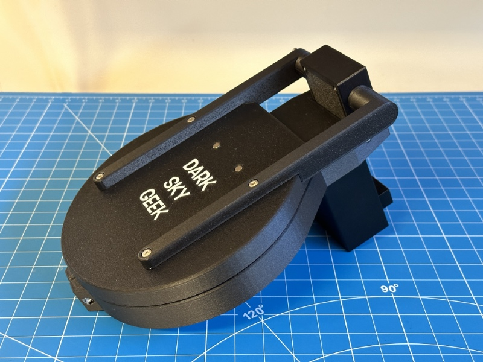

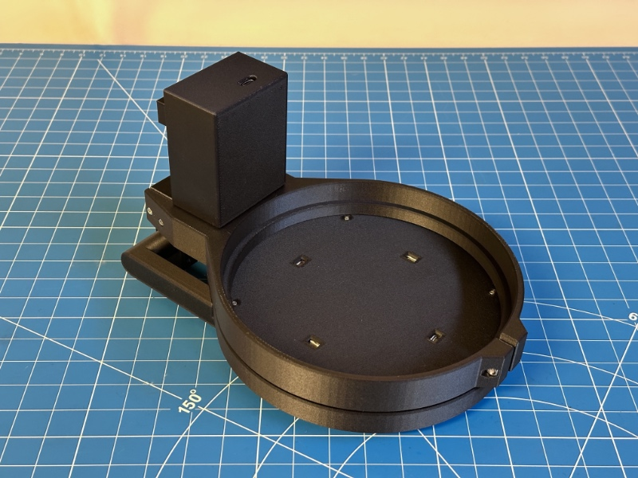

## Demo

Here is a short demo video of the finished product, hosted on YouTube. Check it out!

[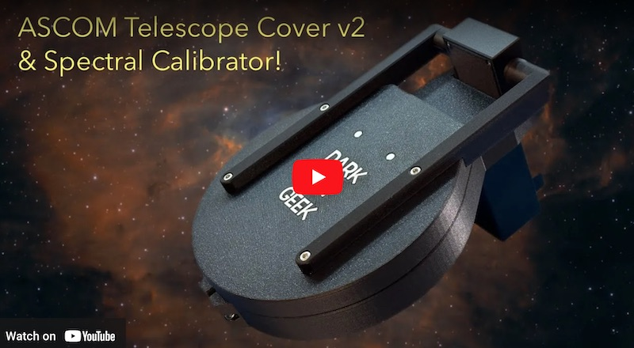](https://www.youtube.com/watch?v=r8KIGEcJ2Xw)

## Pre-Requisites

* A Windows computer (Windows 10 or newer)
* [Microsoft Visual Studio](https://visualstudio.microsoft.com/) (FYI, I used the 2022 edition...)
* [ASCOM Platform 6](https://ascom-standards.org/)
* [ASCOM Platform Developer Components](https://ascom-standards.org/COMDeveloper/Index.htm)
* [Arduino IDE](https://www.arduino.cc/en/software)
* [FreeCAD](https://www.freecadweb.org/), a free and open-source 3D parametric modeler
* A 3D printer able to print PETG, and a slicer (I use a Bambu Lab X1C)
* A few basic tools that any tinkerer must own, such as [a breadboard](https://www.amazon.com/dp/B07LG9V8WQ?tag=darkskygeek-20), [a soldering iron](https://www.amazon.com/dp/B08M9B4MP4?tag=darkskygeek-20), [a bench power supply](https://www.amazon.com/dp/B07GCJ5QHF?tag=darkskygeek-20), etc.

## Hardware / BOM

* [Seeeduino XIAO](https://www.seeedstudio.com/Seeeduino-XIAO-Arduino-Microcontroller-SAMD21-Cortex-M0+-p-4426.html) (You can get it quicker from Amazon, but you will have to pay twice as much!)
* [Capacitors](https://www.amazon.com/dp/B07PBQXQNQ?tag=darkskygeek-20)
* [Resistors](https://www.amazon.com/dp/B08FD1XVL6?tag=darkskygeek-20)
* [Diodes](https://www.amazon.com/dp/B08SBTS2KZ?tag=darkskygeek-20)
* [FQP30N06L](https://www.amazon.com/dp/B07WHSD3GJ?tag=darkskygeek-20) (logic-level MOSFET)
* [EL Inverter](https://www.amazon.com/dp/B08Q7CNZ7F?tag=darkskygeek-20)
* [Neon bulbs](https://www.amazon.com/dp/B07CPY6TM5?tag=darkskygeek-20)
* [270° servo motor with analog feedback](https://www.dfrobot.com/product-1709.html)
* [8x2mm magnets](https://www.amazon.com/dp/B077KYBYYY?tag=darkskygeek-20)
* [Brass inserts for 3D printed parts](https://www.amazon.com/dp/B0BDD3865B?tag=darkskygeek-20)
* [Assortment of small metric screws, nuts, and washers](https://www.amazon.com/dp/B08JCKH31Q?tag=darkskygeek-20)

## ASCOM Driver

### Downloading And Installing The Driver

You can install the ASCOM driver by simply running the executable setup file that you will find in the [releases page](https://github.com/jlecomte/ascom-telescope-cover-v2/releases). By default, it places files under `C:\Program Files (x86)\Dark Sky Geek\Telescope Cover V2 ASCOM Driver`.

### Compiling The Driver (For Developers Only)

Open Microsoft Visual Studio as an administrator (right click on the Microsoft Visual Studio shortcut, and select "Run as administrator"). This is required because when building the code, by default, Microsoft Visual Studio will register the compiled COM components, and this operation requires special privileges (Note: This is something you can disable in the project settings...) Then, open the solution (`ASCOM_Driver\TelescopeCoverV2.sln`), change the solution configuration to `Release` (in the toolbar), open the `Build` menu, and click on `Build Solution`. As long as you have properly installed all the required dependencies, the build should succeed and the ASCOM driver will be registered on your system. The binary file generated will be `ASCOM_Driver\bin\Release\ASCOM.DarkSkyGeek.TelescopeCoverV2.dll`.

## Arduino Firmware

### Microcontroller Compatibility

Pretty much all Arduino-compatible boards should work. There is nothing magical about the firmware. However, this was developed for, and tested with a [Seeeduino XIAO](https://www.seeedstudio.com/Seeeduino-XIAO-Arduino-Microcontroller-SAMD21-Cortex-M0+-p-4426.html), so that is what I recommend for this project.

### Compiling And Uploading The Firmware

* If needed, add support for the board that you are using in your project.
* Then, connect your board to your computer using a USB cable, open the sketch file located at `Arduino_Firmware\Arduino_Firmware.ino`, and click on the `Upload` button in the toolbar.

### Calibration Procedure

This is a one-time operation. Disconnect the right arm from the servo. Then, from the Arduino IDE, connect to the device. Using the Arduino IDE serial monitor, type `COMMAND:COVER:CALIBRATE`. This will launch the calibration procedure for the servo analog feedback. Once it has completed, re-attach the right arm to the servo. The device is now ready to be used.

## Electronic Circuit

Here is the KiCad schematics:

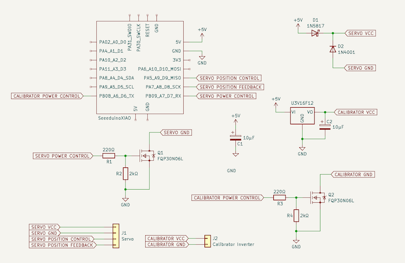

I very strongly recommend prototyping it first, using a breadboard:

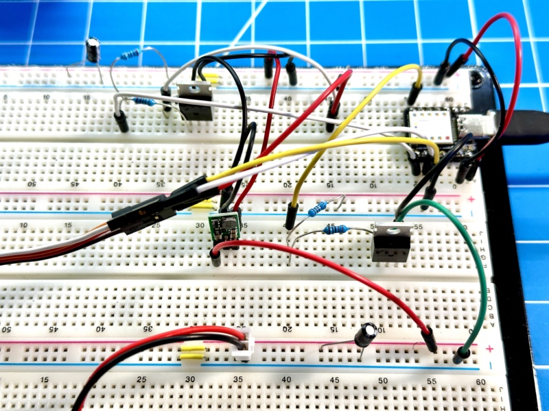

Here is the routed PCB in KiCad:

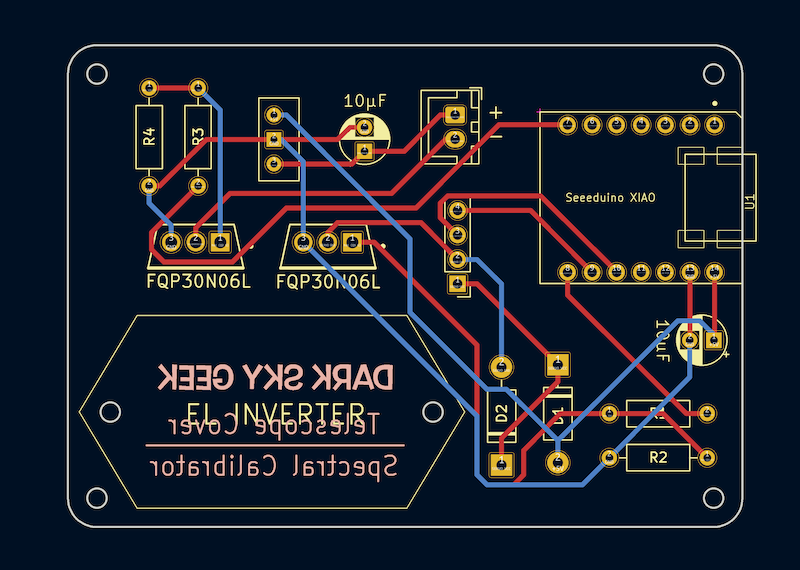

**Note:** You can directly use [PCBWay.zip](KiCad_Project/PCBWay.zip) to order your PCB from [PCB Way](https://www.pcbway.com/).

Once you've received your PCB and soldered all the components, it should look like the following:

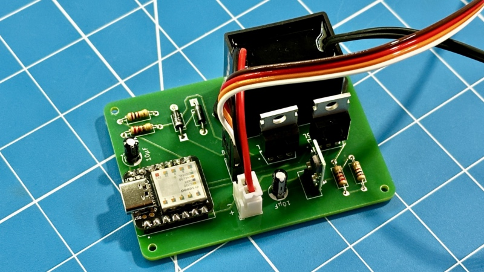

## 3D Model

:warning: **IMPORTANT:** :warning: The 3D model is not really parametric. Therefore, it will NOT scale well. Be warned that I will NOT provide any support for the 3D model, i.e., you are on your own. If you open an issue relating to the 3D model, I will close it (while I will provide adequate support for everything else in this project...)

Here is what the 3D model looks like in FreeCAD:

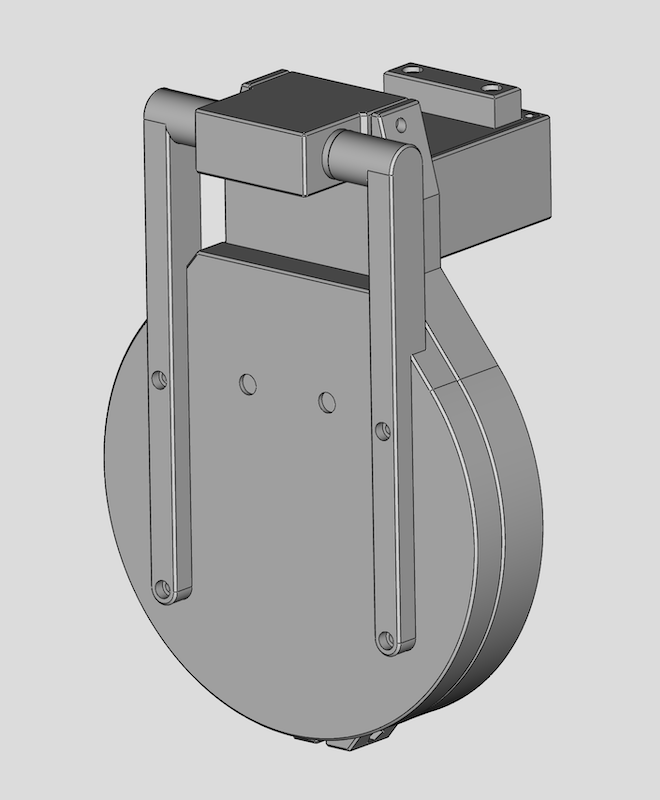

Once you've updated the model to fit your needs, you can export the parts as STL and print them on your 3D printer.

Here is how the neon bulbs are installed on the back of the cover lid:

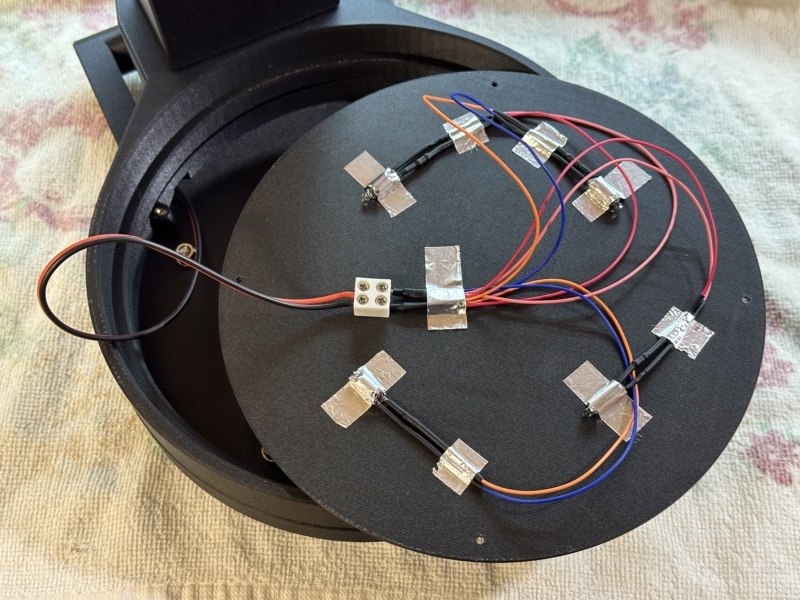

A 47kΩ resistor is soldered to _each_ bulb, and the 4 x _resistor + bulb_ are wired in parallel (that is critical!)

The wires that power up those bulbs travel through the servo box and the left arm, so they are not directly visible, which makes for a very clean final product.

## Using With NINA

Once you have installed the driver, open NINA, go to the `Equipment` tab and select `Flat Panel`. You should be able to select the `DarkSkyGeek Telescope Cover & Spectral Calibrator` device from the device dropdown:

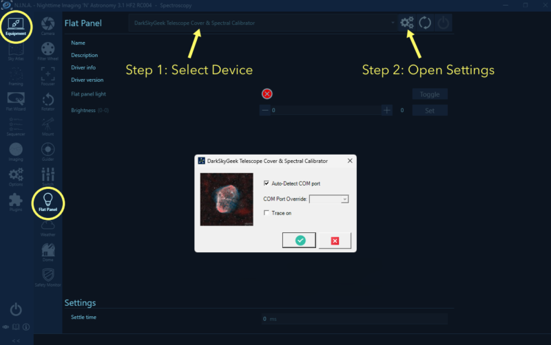

Then, you can connect to the device, and all the standard controls should appear, allowing you to test and use your device. Enjoy!

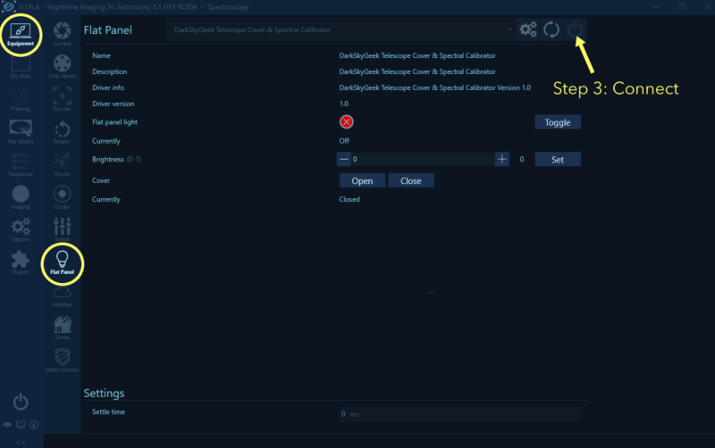

## Known Issues

### Device Access Synchronization

I made sure that access to the serial port was synchronized, thereby preventing a second serial command from being sent if the reply to the first one has not yet been received. However, that code only works in multi-threaded applications. It will not work as expected if the same device is used by two different applications (i.e., processes) as they will each have their own instance of the ASCOM driver, and therefore their own locking object. Indeed, I opted to use the tried-and-true approach of implementing ASCOM drivers (output as a Class Library). Switching to a local COM server would have allowed me to resolve this relatively minor issue, but it seemed overkill for my use case.

## Ideas For Improvements

* Add a physical button (or several buttons) to manually control the device could be a relatively simple enhancement.
* Leverage a small embedded LiPo battery and use BLE for communication, thereby completely removing the need for a USB cable.
* Make the 3D model more scalable so that it can be easily adapted to various telescopes.

**Note:** These are just ideas for you, in case you would like to challenge yourself. I am not planning to implement any of these ideas.
